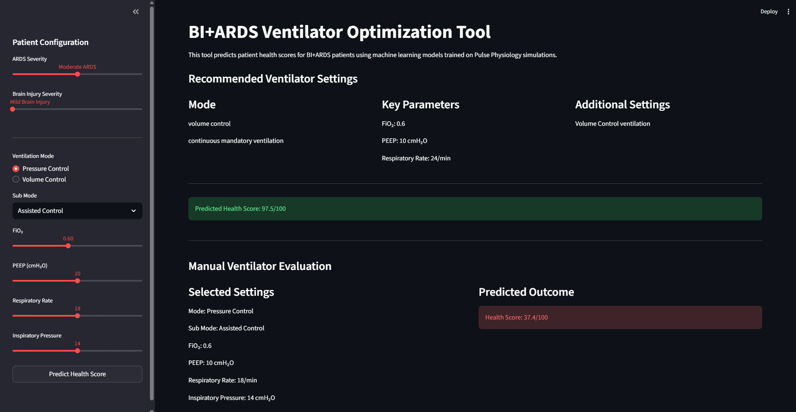
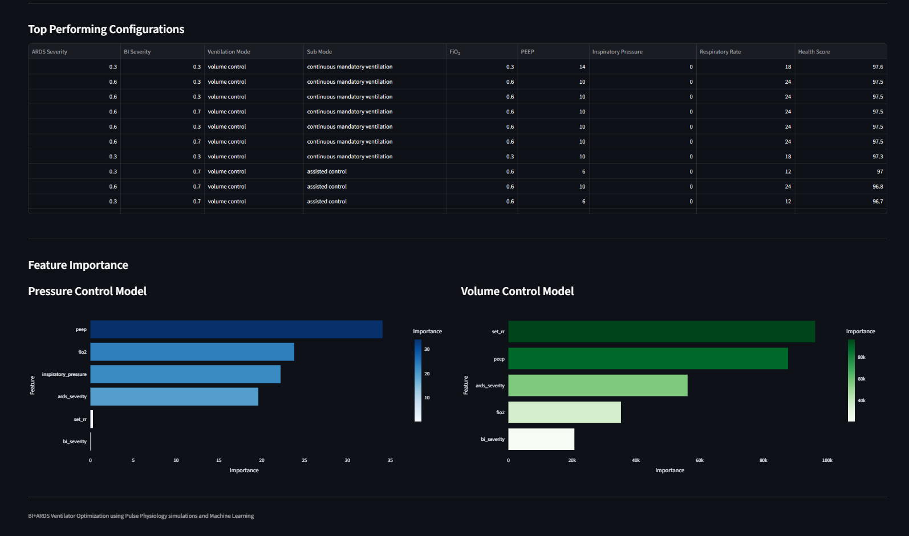

BI+ARDS Ventilator Optimization using Machine Learning

## Overview

This project develops an AI-assisted clinical decision support system for optimizing mechanical ventilator settings in patients suffering from:

* Acute Respiratory Distress Syndrome (ARDS)
* Brain Injury (BI)

The system combines:

* Physiological simulation using the Pulse Physiology Engine
* Machine Learning surrogate modeling
* Ventilator parameter optimization
* Interactive Streamlit deployment

The goal is to recommend ventilator settings that maximize overall patient health while balancing oxygenation and lung-protective ventilation strategies.

---

## Clinical Motivation

ARDS severely impairs lung gas exchange and often requires mechanical ventilation.

When ARDS occurs alongside Brain Injury:

* ARDS requires aggressive lung-protective ventilation
* Brain Injury requires stable intracranial pressure
* Incorrect settings can worsen both lung and neurological outcomes

Current ventilator strategies rely heavily on clinician experience and generalized protocols.

This project explores whether machine learning can generate personalized ventilator recommendations for different disease severities.

---

## Project Workflow

```text
Patient Simulation (Pulse Engine)
            ↓
Generate Physiological Dataset
            ↓
Compute Health Score
            ↓
Train ML Models
            ↓
Compare 9 Regression Models
            ↓
Optimize Ventilator Settings
            ↓
Deploy Streamlit Clinical Tool
```

---

## Simulation Design

### Total Simulations

* 3,888 patient-ventilator combinations

### Disease Severity Levels

| Parameter             | Values        |
| --------------------- | ------------- |
| ARDS Severity         | 0.3, 0.6, 0.9 |
| Brain Injury Severity | 0.3, 0.7      |

### Ventilator Parameters

| Parameter                 | Values                            |
| ------------------------- | --------------------------------- |
| FiO₂                      | 0.3, 0.6, 1.0                     |
| PEEP                      | 6, 10, 14                         |
| Respiratory Rate          | 12, 18, 24                        |
| Inspiratory Pressure (PC) | 8, 14, 20                         |
| Tidal Volume (VC)         | Multiple levels                   |
| Ventilation Modes         | Pressure Control / Volume Control |

---

## Machine Learning Models Compared

Nine regression models were evaluated separately for:

* Pressure Control ventilation
* Volume Control ventilation

### Models

* Random Forest
* LightGBM
* XGBoost
* Gradient Boosting
* Decision Tree
* Ridge Regression
* Lasso Regression
* SVR
* MLP Regressor

---

## Best Performing Models

| Ventilation Mode | Best Model    |
| ---------------- | ------------- |
| Pressure Control | Random Forest |
| Volume Control   | LightGBM      |

---

## Optimization Strategy

A full grid search was performed across the ventilator action space.

Objective:

```text
Find ventilator settings that maximize predicted patient health score.
```

The ML model acts as a fast surrogate for expensive Pulse simulations.

---

## Streamlit Application

The interactive dashboard allows users to:

* Select ARDS severity
* Select Brain Injury severity
* Test ventilator settings manually
* View predicted health score
* Compare against optimized recommendations
* Visualize feature importance

---

## Repository Structure

```text
app/                → Streamlit application
training/           → Model comparison and training
optimization/       → Ventilator optimization algorithms
models/             → Saved ML models
results/            → Outputs and evaluation metrics
presentation/       → Final project presentation
```

---

## Example Features Used

### Pressure Control

* ARDS severity
* BI severity
* FiO₂
* PEEP
* Inspiratory pressure
* Respiratory rate

### Volume Control

* ARDS severity
* BI severity
* FiO₂
* PEEP
* Respiratory rate

---

## Technologies Used

* Python
* Streamlit
* Scikit-learn
* LightGBM
* XGBoost
* Pandas
* NumPy
* Plotly
* Pulse Physiology Engine

---

## How to Run

### 1. Clone Repository

```bash
git clone https://github.com/shreya-singal/bi-ards-ventilator-optimization.git
cd bi-ards-ventilator-optimization
```

### 2. Install Requirements

```bash
pip install -r requirements.txt
```

### 3. Launch Streamlit App

```bash
streamlit run app/app.py
```

---

## Streamlit Dashboard

### Main Interface



### Feature Importance and Top Configurations



## Results

The optimized recommendations showed:

* Pressure Control performs better for moderate/severe ARDS
* Volume Control performs better in milder cases
* Assisted modes generally improve oxygenation stability
* FiO₂ and PEEP strongly influence oxygenation outcomes

---

## Future Work

* Reinforcement Learning based ventilator control
* Real ICU dataset validation
* Explainable AI integration
* Dynamic time-series optimization
* Multi-objective optimization for lung + brain protection

---

## Author

Shreya Singal
B.Tech, MEMS Department
Indian Institute of Technology Bombay

---


